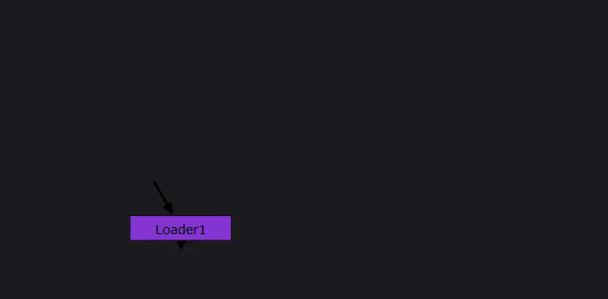

# Loader for Nuke


**Loader** is a powerful tool for **Foundry Nuke** that allows users to efficiently load **image sequences, geometry, and scripts** into Nuke’s node graph using specified queries.



## 🚀 Features

- **Batch Load Assets** – Quickly bring in multiple image sequences, geometry files, or scripts.
- **Query-Based Import** – Use structured queries to filter and load only what you need.
- **Templating** – Automate and standardize shot setups.
- **Supervisors & Leads** – Ideal for reviewing and managing large volumes of shots.
- **Automation** – Easily generate contact sheets, batch reformats, apply effects on multiple file.

## 🛠️ Installation

1. Clone this repository:
   ```sh
   git clone https://github.com/harut-harutyunyan/loader.git
   ```
2. Copy the loader folder and paste it anywhere in your plugin path (like in ~/.nuke).
3. Open the file init.py inside your ~/.nuke folder with a text editor, or create it if it
doesn’t exist.
4. Add the following lines:
   ```python
   import nuke
   nuke.pluginAddPath("./loader")
   ```

## 📖 Documentation

For detailed usage and customization, check out the [documentation](./docs/README.md).

## 🤝 Contributing

Pull requests are welcome! If you have suggestions or issues, please open an [issue](https://github.com/harut-harutyunyan/loader/issues).

## 📜 License

This project is licensed under the [MIT License](./LICENSE).

---
