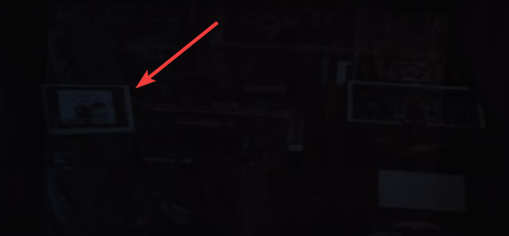

### query expressions

- #### string
    The *string* may contain environment variables encapsulated in `$` sign

    `E_$MY_SHOT$_fg01` will be resolved to `E_abc010_0020_fg01`

- #### regex
    Will search in directory using provided *regex* pattern and return all matches.

    `re:^abc` will be resolved to `abc010_0010, abc010_0020, abc010_0030`
    regular expressions can contain environment variables encapsulated in `$` sign
    `re:^$MY_SEQUENCE$` will be resolved to `abc010_0010, abc010_0020, abc010_0030`

- #### python
    Construct file name or path using short *python* expressions.
    `pd` variable is available. And will return the parent directory.
    the output of the expression should be a *list* or *str* variable `res`.

    `py:import os\nres=os.listdir(pd)` will be resolved to `abc010_0010, foo015_0010`

- #### version search
    Will search the contents of parent directory for the *version number* provided.
    Options:
    - Specific version number `v:1` or `v:001` will be resolved to `abc010_0020_comp_v001`
    - Latest version `v:latest` will be resolved to `abc010_0020_comp_v004`
    - All versions `v:all` will be resolved to `abc010_0020_comp_v001, abc010_0020_comp_v002, abc010_0020_comp_v003, abc010_0020_comp_v004`
    - Previous versions using *negative numbers* `v:-1` will return the `v003` if latest version is `v004`.
    Version search can be combined with other searching options.

    `re:\babc\w*comp\w*\b && v:latest` will be resolved to `abc010_0020_comp_v004`

- #### recursive search
    will search *recursively* the parent directory until it finds the match for the query expression.

    `*re:\.exr$` will return all `.exr` files inside all child directories of the parent directory.

***

