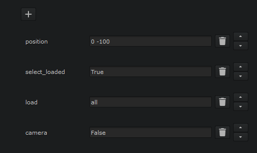

# Load Settings

## List of all the available load settings.

- `reconnect`: If set to True connects loaded node to the loader node's output. Connect loaded node to the loader if set to False.
  - **Default**: `False`

- `position`: Position(x, y) of the loaded node relative to the loader
  - **Default**: `0 -100`

- `delete_after`: Delete loader node after execution.
  - **Default**: `False`

- `select_loaded`: Select loaded node.
  - **Default**: `True`

- `load`: If query return multiple files, choose which one to load. Available options "all", "first" and "last".
  - **Default**: `all`

- `deep`: Use deep read to read in the file.
  - **Default**: `False`

- `camera`: Use camera node to load 3d file(.abc).
  - **Default**: `False`

- `classic3d`: Use classic 3d nodes(old 3d system) to load the 3d file.
  - **Default**: `True`

The settings that are not set in Loader properties, will use their default values. You can chage the default values for all the settings in `loader_config.py` configuration file.
When creating a loader node by default not all the settings are displayed in the properties panel. You can configure what is visible in properties panel in `loader_config.py` configuration file Bby editing `default_settings` variable.

***
[< Previous](./query.md) | [Next>](./bestpractice.md)
